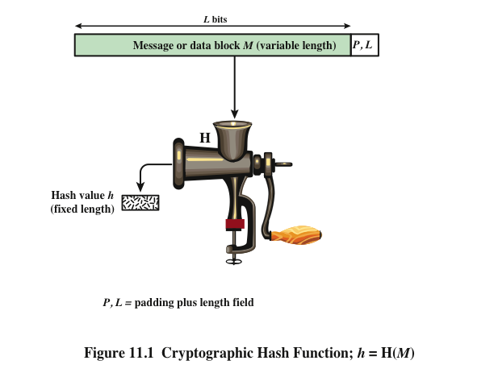
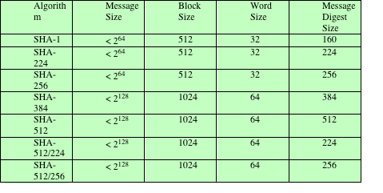
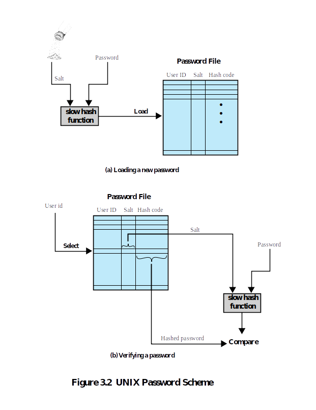

```python
import hashlib
import uuid
```

# Hash Functions

A hash function $H$ accepts a variable-length block of data $M$  as input and produces a fixed-size hash value $h =  H(M)$. A “good” hash function has the property that the results of applying the function to a large set of inputs will produce outputs that are evenly distributed and apparently random. In general terms, the principal object of a
hash function is data integrity. A change to any bit or bits in M  results, with high probability, in a change to the hash code.



The kind of hash function needed for security applications is referred to as a cryptographic hash function . A cryptographic hash function is an algorithm for which it is computationally infeasible (because no attack is significantly more efficient than brute force) to find either 

     a. a data object that maps to a pre-specified hash result (the one-way property) or 
     b. two data objects that map to the same hash result (the collision-free property). 

Because of these characteristics, hash functions are often used to determine whether or not data has changed.

## Secure Hash Algorithm (SHA)
In recent years, the most widely used hash function has been the Secure Hash Algorithm (SHA). SHA was developed
by the National Institute of Standards and Technology (NIST) and published as a federal information processing standard (FIPS 180) in 1993. When weaknesses were discovered in SHA, now known as SHA-0, a revised version was issued as FIPS 180-1 in 1995 and is referred to as SHA-1. SHA-1 produces a hash value of 160 bits. In 2002, NIST  defined three new versions of SHA, with hash value lengths of 256, 384, and 512 bits, known as SHA-256, SHA-384, and SHA-512, respectively. Collectively, these hash algorithms are known as SHA-2. These new versions have the same underlying structure and use the same types of modular arithmetic and logical binary operations as SHA-1.




**Exercise:** Using the hashlib pakage (see: https://docs.python.org/3/library/hashlib.html), generate hash values for a given message using the SHA algorithms listed above. 


```python
# SHA-1

message = b'Hello World'
hash_object = hashlib.sha1(message)
hex_dig = hash_object.hexdigest()
print('sanity: ', hex_dig == '0a4d55a8d778e5022fab701977c5d840bbc486d0')
print('Message Digest Size: ', len(hex_dig) * 4)
```

    sanity:  True
    Message Digest Size:  160
    


```python
# SHA-224
message = b'Hello World'
hash_object = hashlib.sha224(message)
hex_dig = hash_object.hexdigest()
print('sanity: ', hex_dig == 'c4890faffdb0105d991a461e668e276685401b02eab1ef4372795047')
print('Message Digest Size: ', len(hex_dig) * 4)
```

    sanity:  True
    Message Digest Size:  224
    


```python
# SHA-256
message = b'Hello World'
hash_object = None
hex_dig = None
print('sanity: ', hex_dig == 'a591a6d40bf420404a011733cfb7b190d62c65bf0bcda32b57b277d9ad9f146e')
print('Message Digest Size: ', len(hex_dig) * 4)
```


```python
# SHA-384
message = b'Hello World'
hash_object = None
hex_dig = None
print('sanity: ', hex_dig == '99514329186b2f6ae4a1329e7ee6c610a729636335174ac6b740f9028396fcc803d0e93863a7c3d90f86beee782f4f3f')
print('Message Digest Size: ', len(hex_dig) * 4)
```


```python
# SHA-512
message = b'Hello World'
hash_object = None
hex_dig = None
print('sanity: ', hex_dig == '2c74fd17edafd80e8447b0d46741ee243b7eb74dd2149a0ab1b9246fb30382f27e853d8585719e0e67cbda0daa8f51671064615d645ae27acb15bfb1447f459b')
print('Message Digest Size: ', len(hex_dig) * 4)
```

## Application: Unix Password Scheme
A widely used password security technique is the use of hashed passwords and a salt value. This scheme is found on virtually all UNIX variants as well as on a number of other operating systems. The following procedure is employed.





To load a new password into the system, the user selects or is assigned a password. This password is combined with a fixed-length salt value which is a pseudorandom or random number. The password and salt serve as inputs to a
hashing algorithm to produce a fixed-length hash code. The hashed password is then stored, together with a plaintext copy of the salt, in the password file for the corresponding user ID. The hashed password method has been shown to be secure against a variety of cryptanalytic attacks.

When a user attempts to log on to a UNIX system, the user provides an ID and a password. The operating system uses the ID to index into the  password file and retrieve the plaintext salt and the encrypted password. The salt and user-supplied password are used as input to the encryption routine. If the result matches the stored value, the password is accepted.

The salt serves three purposes:

-  It prevents duplicate passwords from being visible in the password file. Even if two users choose the same password, those passwords will be assigned different salt values. Hence, the hashed passwords of the two users will differ.

- It greatly increases the difficulty of offline dictionary attacks. For a salt of length $b$ bits, the number of possible passwords is increased by a factor of $2^b$, increasing the difficulty of guessing a password in a dictionary attack.

- It becomes nearly impossible to find out whether a person with passwords on two or more systems has used the same password on all of them.


**Exercise:** Implement `load_new_password()` to create and store password for a new user. Use SHA-256 for the hash function.


```python
def load_new_password(user_name, password):
    
    # generate salt using a random number (we use uuid package) 
    salt = uuid.uuid4().hex
    
    # generate hashed password using SHA 256
    hash_code = None
    
    # make a dictioanry for a database
    ret = {user_name: {'SALT': None,
                        'HASH_CODE': None
                      }
          }
    
    return ret 
```

**Exercise:** Implement `verify_password()` to check whether the password entered for the user is correct.


```python
def verify_password(user_name, password, password_database):
    salt = None
    checker = None
    return password_database[None][None].hexdigest()  == checker.hexdigest() 
    
```


```python
user_name = 'Bob'
password = 'hello_bob'
password_database = load_new_password(user_name, password)
is_valid = verify_password(user_name, password, password_database)
print('Valid password: ', is_valid)

user_name = 'Bob'
password = 'hello_bob_12312'
is_valid = verify_password(user_name, password, password_database)
print('Valid password: ', is_valid)

```
